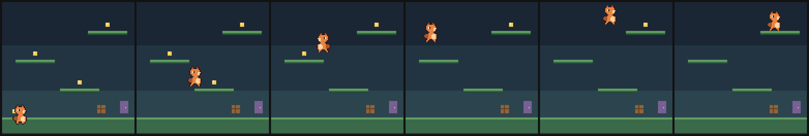
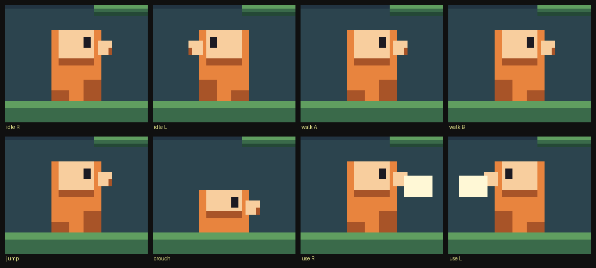
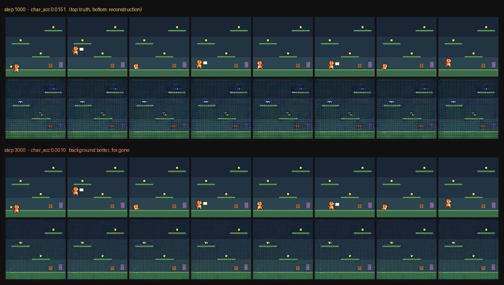
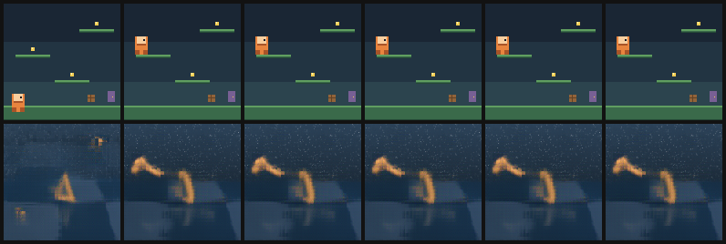
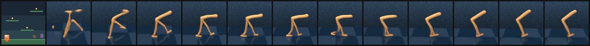
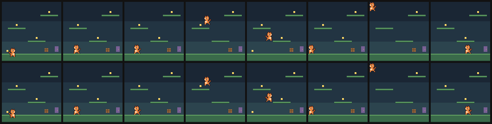
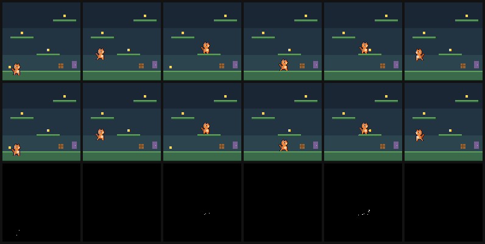
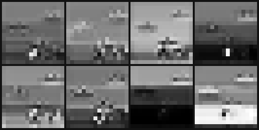
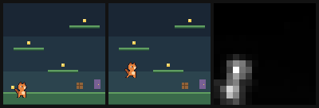

# Small Worlds

This file combines the technical report *Small Worlds: Subject-Scale Failure in Reconstruction-Trained World-Model Tokenizers* (2 September 2026), the project report *Pixel World Model* (1 September 2026; the `pixel-world-model-report` PDF), the tokenizer demo *Compressing a world 24× without losing the fox* (2 September 2026), the original project brief, and the dataset write-up.

---

# Part I — Technical report

**Sachin** · Technical Report · 2 September 2026

## Abstract

Latent world models compress each observation into a low-dimensional code and predict forward in that space. The compression is trained by a reconstruction objective averaged over the frame, which implicitly assumes that reconstruction error is a good proxy for the utility of the representation. This assumption fails when the controllable entity occupies a small fraction of the observation.

We construct a controlled environment in which the agent occupies 1.3% of the frame and the renderer emits a known finite palette, permitting exact per-pixel measurement restricted to the agent. Under a published world-model tokenizer trained on this data, whole-frame reconstruction accuracy increases monotonically from 0.42 to 0.77 while accuracy measured on the agent's own pixels **decreases** from 0.0151 to 0.0010: the model acquires a partial representation of the agent and subsequently discards it, because omitting it is near loss-optimal under a mean-over-patches objective. A reconstruction containing no agent scores 0.987 by the whole-frame metric.

We identify two design choices that eliminate the failure — spatially structured rather than global latents, and per-pixel classification over the known palette rather than RGB regression — and report a tokenizer reaching 0.9994 agent accuracy at 2.9M parameters. A dynamics model trained on the resulting latents yields action-conditioned rollouts with correct directional response and no measurable drift over eight imagined frames. The complete system is 4.4M parameters and runs at 101 fps on consumer hardware.

We additionally report a negative result: three runtime hallucination predictors correlate only weakly with realised rollout error in this setting (ρ = 0.27, 0.09, 0.03), and we identify a precondition on the tokenizer that determines whether they can discriminate at all.

**System overview.** Observations are compressed 24× into a spatially structured latent grid. A flow-matching dynamics model predicts the next latent conditioned on the preceding eight and an action embedding. The decoder assigns each pixel one of 21 palette classes. Beyond the initial context window the system is closed-loop: each predicted frame becomes context for the next.

| stage | what |
|---|---|
| Environment | pygame, 6 actions, 128×128, 21 colours, 2,025,385 frames |
| Encoder | conv, spatial, 8×16×16 latent, 2,048 numbers, 24× compression |
| Dynamics | flow matching, action-conditioned |
| Decoder | 21-way per pixel, cross-entropy |
| Hallucination signals | `u_r` ‖z − Enc(Dec(z))‖ · `u_f` drift across Euler substeps · `u_s` spread across seeds |
| Size | tokenizer 2.9M · dynamics 1.5M |

## 1. Introduction

World models learn a predictive simulator of an environment, enabling planning or policy learning within imagination rather than the environment itself. Contemporary systems predominantly operate on latent representations: an encoder compresses each observation, a dynamics model predicts sequences of codes, and a decoder reconstructs observations when required [3].

The encoder is typically trained by minimising reconstruction error over the full observation. This objective is agnostic to which regions of the observation are causally relevant. Where the relevant content occupies a substantial fraction of the frame, the distinction is immaterial. Where it does not, the objective and the downstream requirement diverge.

Alonso et al. [2] document consequences of this divergence in Atari, reporting that small reward tokens and adversaries are rendered inconsistently across frames by discrete-latent world models, and attribute this to information loss in the latent bottleneck. Their remedy is architectural: operate in pixel space and avoid the bottleneck entirely.

This work characterises the same phenomenon under conditions permitting exact measurement, and proposes a remedy that retains the bottleneck. Contributions:

1. An environment in which the controllable agent occupies a measured 1.3% of the observation and the renderer emits exactly 21 colours, so reconstruction fidelity can be measured as exact per-pixel palette agreement and restricted to arbitrary semantic subsets.
2. Evidence that agent-restricted and whole-frame reconstruction accuracy can move in opposite directions during training, and that a threshold on the whole-frame metric admits models containing no agent.
3. A tokenizer design that eliminates the failure in this setting, and a complete world model built on it.
4. A negative result on runtime hallucination prediction, with an identified precondition on the tokenizer.

## 2. Related work

**Latent world models.** Dreamer and successors compress observations into compact latents and learn dynamics in that space [3]. Tokenizers in this family are trained by reconstruction, typically combining pixel error with a perceptual term.

**Visual detail in world models.** Alonso et al. [2] argue that discrete latent compression discards detail material to control, demonstrating inconsistent rendering of small objects, and propose pixel-space diffusion as an alternative. Our analysis agrees on the diagnosis and differs on the remedy.

**Discrete-output image models.** Autoregressive image models predict categorical distributions over quantised values; VQGAN [4] combines quantisation with perceptual and adversarial objectives to preserve high-frequency structure. Our decoder likewise predicts a categorical distribution, but over the environment's known palette, making the output space exact rather than learned.

**Runtime uncertainty estimation.** Hansen and Wang [1] propose three label-free predictors of world-model hallucination computable from quantities already produced during generation, reporting rank correlations near 0.8 with realised rollout error. We implement all three and report weaker correlations, with an analysis of why.

## 3. Environment

The environment is a deterministic 2D platformer rendered at 128×128 with a fixed camera and a palette of exactly 21 colours. A single agent sprite occupies 14×20 pixels; the measured mean fraction of frame pixels belonging to the agent is 1.30%. Six discrete actions are encoded into a 16-dimensional zero-padded continuous vector with a validity mask, following the convention of [3], of which three dimensions are valid.

**Verified reachability.** Level connectivity is derived by simulating the physics from every admissible launch position and recording the resulting landing platform, rather than asserted at design time. An initial hand-specified layout was found by this procedure to leave three of five platforms unreachable. The layout used was selected by searching approximately 8,000 candidates under two constraints: full connectivity, and every launch window on the critical path wider than one movement step.

**Controlled coverage.** Each episode is assigned a target coin drawn from a skewed distribution and terminates on collection. A goal therefore constitutes a task, and the uppermost platform is reached in approximately 3% of episodes by construction. Episode share and frame share are deliberately mismatched, reproducing the heavy-tailed coverage structure of larger corpora.

The corpus comprises 2,025,385 frames over 35,000 episodes, collected from a mixture of scripted, noise-perturbed and random policies. Measured frame redundancy is high: 25.4% of sampled frames are unique.

*Figure 2. Environment. Six frames from a single episode showing a four-hop ascent to the low-coverage upper platform.*

### 3.1 Action separability

Prior to training, the visual distinguishability of each action was measured by branching on every action from identical states, rendering each outcome, and computing pairwise pixel disagreement. Two results are relevant.

First, one action in the initial design produced outcomes identical to the null action at every horizon, differing in only a single frame per episode. No model can acquire such an action, and its presence depresses any action-fidelity metric while presenting as a model deficiency. It was merged into a context-sensitive action with a persistent visual effect.

Second, separability is bounded above by approximately twice the sprite's area. The initial sprite occupied 0.71% of the frame against a measured separability of 1.49% and a bound of 1.43%, indicating saturation; no encoding change could improve it. Redrawing the sprite as an asymmetric profile increased orientation distinguishability from 2.9% to 71.4% of sprite pixels.

*The character, 14×20 px, authored as pixel maps rather than stacked rectangles. Facing is legible from the drawing itself — snout leading, tail trailing.*

## 4. The subject-scale failure

A published tokenizer architecture [3] was trained from scratch on the corpus. Table 1 reports both metrics over the first 3,000 steps.

**Table 1.** Whole-frame and agent-restricted palette accuracy during tokenizer training. The metrics diverge after step 1,000.

| Step | Whole-frame | Agent-restricted | PSNR (dB) |
|---|---|---|---|
| 1,000 | 0.4245 | 0.0151 | 16.93 |
| 2,000 | 0.7549 | 0.0015 | 20.51 |
| 3,000 | 0.7656 | 0.0010 | 21.09 |

Agent-restricted accuracy attains its maximum at step 1,000 and declines by a factor of fifteen thereafter, while whole-frame accuracy and PSNR increase monotonically throughout. The model therefore acquires a partial representation of the agent and subsequently discards it.

This behaviour is consistent with the objective rather than anomalous under it. With the agent occupying 1.3% of pixels, allocating latent capacity to it is not competitive against allocating that capacity to the remaining 98.7% when error is averaged uniformly. A reconstruction omitting the agent entirely attains 0.987 whole-frame accuracy, exceeding any threshold that would be considered demanding.

An intermediate intervention is informative. Weighting each patch by its variance, intended to upweight the agent's high-frequency boundary, increased whole-frame accuracy to 0.6664 and PSNR to 22.07 while **reducing** agent accuracy to 0.0075. The observation contains substantially more high-variance background structure — platform boundaries, sky gradients, collectibles — than agent pixels, and the reallocated gradient accrued to it. Weighting by local detail is not equivalent to weighting by relevance.

*Figure 4. The failure, qualitatively. Reconstructions at step 1,000 (upper) and step 3,000 (lower). Background fidelity visibly improves while the agent disappears.*

### 4.1 Transfer from pretrained weights

For completeness we evaluated the released checkpoint of [3] directly. Its tokenizer does not degrade our observations but substitutes for them, reconstructing the agent as an articulated manipulator at 18.56 dB with accuracy nearly invariant across distinct inputs (Figure 5). Its normalised latent round-trip residual on our frames is 0.996 against a uniform-noise reference of 1.029, indicating that the domain is approximately indistinguishable from noise under that encoder. Conditioned on one of our frames, its dynamics model produces a sharp and temporally coherent rollout of an unrelated control task. We conclude that the architecture is sound and the weights encode an incompatible prior; since finetuning the tokenizer invalidates a dynamics model trained on its frozen latents, both stages require retraining regardless.

*Figure 5. Transfer failure. Observations (upper) and their reconstruction under the released tokenizer of [3] (lower).*

*Seeded from one of our frames (far left), its dynamics model rolls forward into a DMControl walker — sharp, coherent, temporally consistent, and an entirely different world.*

## 5. Method

### 5.1 Tokenizer

Two departures from the reference architecture address the failure directly.

**Spatially structured latents.** The encoder produces a grid *z* ∈ ℝ8×16×16 (2,048 values, 24× compression) rather than a set of global vectors. Because the code retains spatial correspondence, the agent occupies specific cells and cannot be marginalised into the background representation. This addresses the mechanism identified by [2] while retaining the bottleneck.

**Palette classification.** The renderer emits a known finite palette *P*, |*P*| = 21, so reconstruction is a classification problem. The decoder produces logits over *P* at each pixel and is trained with weighted cross-entropy

ℒ = − ∑i *w*c(i) log *p*i(*c(i)*)

where *c(i)* is the true palette index at pixel *i* and *w* is a per-class weight. Two properties follow. Cross-entropy over a discrete output space cannot produce intermediate values, so blurring is not available as a means of reducing loss. And the class weights provide an explicit mechanism for expressing that the agent's colours are of greater consequence than the background — a statement squared error cannot represent.

The encoder and decoder are convolutional (GroupNorm, SiLU), totalling 2.94M parameters. Training used AdamW at 3×10−4 with cosine decay for 1,500 steps at batch 32.

### 5.2 Dynamics

The dynamics model predicts *z*t+1 from the preceding eight latents and an action embedding, trained by flow matching with target prediction: for τ ∼ U(0,1) and ε ∼ N(0,I), the model receives *z*τ = (1−τ)ε + τ *z*t+1 and is trained to recover *z*t+1 under mean squared error.

This formulation is selected deliberately. Two of the three predictors of [1] are defined only for denoising dynamics: flow instability requires solver substeps, and inter-seed variance requires stochastic sampling. A direct regressor renders both undefined, which excludes discrete-token alternatives if those diagnostics are to be retained.

The backbone is convolutional over the 16×16 latent grid with FiLM conditioning on the action and noise level, totalling 1.46M parameters. The tokenizer is frozen throughout.

## 6. Results

**Table 2.** Final system. Agent-restricted metrics are computed on held-out data; rollout metrics are computed over eight imagined frames from real context.

| Component | Parameters | Metric | Value |
|---|---|---|---|
| Tokenizer | 2,942,173 | agent-restricted accuracy | 0.9994 |
| | | whole-frame accuracy | 0.9998 |
| | | compression ratio | 24× |
| | | normalised round-trip residual | 0.0048 |
| Dynamics | 1,459,080 | rollout agent accuracy | 0.8850 |
| | | rollout whole-frame accuracy | 0.9967 |
| System | 4,401,253 | parameters on disk | 17.7 MB |

**Reconstruction.** The tokenizer attains 0.9998 whole-frame and 0.9994 agent-restricted accuracy on held-out observations, corresponding to a mean of 2.5 incorrect pixels per 16,384. The latent responds locally to agent motion, the property that prevents marginalisation.

*Figure 6. Reconstruction. Held-out observations (upper) and reconstructions (lower).*

**Absence of drift.** Per-step rollout accuracy over eight imagined frames is 0.999, 0.998, 0.997, 0.996, 0.997, 0.996, 0.996, 0.995. Long-horizon degradation, anticipated as the principal risk, is not observed at this horizon.

**Action fidelity.** From identical context, forced actions displace the agent by −15.97 px (left), +35.32 px (right) and −0.00 px (null) over twelve imagined frames, averaged over twelve initialisations. Both sign and null response are correct. The magnitude asymmetry reflects the corpus: the level's ascent proceeds left-to-right.

**Training regime.** Rollout accuracy had not converged at 26,000 dynamics steps; a 10,000-step run of the same configuration attained 0.800. The model is therefore optimisation-limited rather than data-limited, having observed 416,000 of approximately 2,000,000 available transitions.

**Inference cost.** 101.5 fps on an M2 GPU, 26.5 fps on M2 CPU, and 93 fps on an A100, each exceeding the 15 fps at which the environment was recorded. Total training compute was 2.3 GPU-hours.

## 7. Runtime hallucination prediction

The three predictors of [1] were implemented and evaluated over 768 rollout windows drawn from held-out and low-coverage splits. Table 3 reports Spearman rank correlation against realised per-frame reconstruction error.

**Table 3.** Rank correlation between each predictor and realised rollout error, *n* = 768.

| Predictor | ρ (this work) | ρ reported [1] |
|---|---|---|
| Round-trip residual | 0.265 | ≈ 0.8 |
| Flow instability | 0.090 | ≈ 0.8 |
| Inter-seed variance | 0.030 | ≈ 0.8 |

We do not interpret this as contradicting [1]. The more plausible account is insufficient variation in the dependent variable: realised error on the designated low-coverage region is 0.0138 against 0.0123 on held-out data. The dynamics model was trained on episodes targeting that region, which constitute 6% of the corpus — rare but present — so the region is not out of distribution for it. All three predictors are directionally correct; none discriminates strongly. Establishing whether the predictors recover their reported performance requires withholding the region from dynamics training entirely, which we identify as necessary future work rather than report as a result.

**A precondition on the tokenizer.** The predictors are computed in latent space and therefore inherit the tokenizer's dynamic range. The released tokenizer of [3] assigns our observations a normalised round-trip residual of 0.996 against a uniform-noise reference of 1.029: the statistic is saturated, and no downstream signal can be recovered from it. The tokenizer reported here assigns 0.0048, two orders of magnitude below. Applications of [1] should verify that the tokenizer possesses round-trip headroom on the target domain; a mismatched tokenizer disables the diagnostics without producing an error.

## 8. Limitations

**Scale.** The system is compact because the domain is compact: 21 colours, 128×128 resolution, a single level, and approximately 26 bits of state per observation. No claim is made that world models generalise to this parameter count. The transferable claims concern the design choices, not the resulting size.

**Applicability of palette classification.** The categorical decoder requires a known discrete output space. This holds for sprite-based environments, diagrams, interface renderings and segmentation maps; it does not hold for photographic observations. The spatial-latent argument carries no such restriction.

**Weighting requires supervision.** The class weights presuppose knowledge of which palette entries constitute the agent. A general formulation would derive relevance from data — for instance, by weighting each pixel according to its sensitivity to the action, which is measurable without labels. We did not evaluate this.

**Horizon.** Rollouts were evaluated to twelve frames. The multi-second horizons at which drift is conventionally reported were not tested.

**Reward.** The environment defines a reward function and records it per frame, but the dynamics model does not predict reward. Extending it with a reward head is straightforward and was not undertaken.

**Single environment.** All results derive from one environment. The subject-scale failure is expected to depend on the fraction of the observation occupied by the agent; characterising that dependence would require varying it systematically.

## 9. Conclusion

Reconstruction objectives averaged over an observation are not neutral with respect to which content is preserved. Where the controllable entity is small, such objectives can be reduced by discarding it, and standard reconstruction metrics not only fail to detect this but improve as it occurs. We demonstrate the effect under exact measurement, show that a plausible threshold on whole-frame accuracy admits models containing no agent, and identify two design choices — spatial latent structure and categorical reconstruction over a known output space — that eliminate it in this setting. The resulting world model is 4.4M parameters, exhibits correct action-conditioned response and no measurable drift over its evaluated horizon, and runs in real time on consumer hardware.

The broader implication concerns evaluation rather than architecture. A metric restricted to the causally relevant subset of an observation is not a refinement of the aggregate metric; the two can move in opposite directions during training. Where the relevant subset is identifiable, it should be measured directly.

## References

1. N. Hansen and X. Wang. *Hallucination in World Models is Predictable and Preventable.* arXiv:2606.27326, 2026.
2. E. Alonso, A. Jelley, V. Micheli, A. Kanervisto, A. Storkey, T. Pearce, F. Fleuret. Diffusion for World Modeling: Visual Details Matter in Atari. NeurIPS, 2024. arXiv:2405.12399.
3. D. Hafner, W. Yan, T. Lillicrap. *Training Agents Inside of Scalable World Models.* arXiv:2509.24527, 2025.
4. P. Esser, R. Rombach, B. Ommer. Taming Transformers for High-Resolution Image Synthesis. CVPR, 2021.

---

# Part II — Pixel World Model (project report)

**Pixel World Model** · 1 September 2026 · phase 3 of 5

Teaching a model to imagine a pixel fox — and measuring when it lies.

We are building a generative world model of a single controllable 2D pixel-art character: press a key, and the model imagines the next frames. The second, more interesting half is that we can predict, at runtime and without labels, the moment the model starts making things up.

## The idea

A world model learns to imagine an environment well enough that you can act inside its imagination. They fail in a specific way: on entering territory the training data never covered, they do not hesitate or blur — they invent, confidently and coherently.

Hansen and Wang (arXiv 2606.27326, June 2026) argue this is fundamentally a data-coverage problem, and therefore both predictable and preventable. They identify three failure modes and three label-free signals computable at runtime from quantities the model already produces:

| Signal | What it measures | Needs |
|---|---|---|
| *u_r* | Tokenizer round-trip residual — how far a predicted latent moves when its decoded frame is re-encoded | encoder + decoder |
| *u_f* | Flow instability — how much the denoiser's prediction moves between solver substeps | flow-matching dynamics |
| *u_s* | Inter-seed variance across independent denoising seeds | stochastic sampling |

Across 9,000 held-out sequences these track realised rollout error at Spearman ρ ≈ 0.8. Our goal is a live signal that spikes on screen the moment the character walks somewhere the training data barely went.

Coverage is the independent variable of the whole experiment, so we need to control it rather than inherit it. A hand-built environment gives ground-truth actions for free and lets us make one region deliberately rare by construction.

## What the world is

A single controllable fox, four mossy ledges, six discrete actions (idle, left, right, jump, crouch, use). Everything is drawn procedurally — there are no image assets in the simulator. Three design decisions carry most of the weight:

**1. The level is verified, not asserted.** Jump arcs were originally hand-computed, and the first level turned out to have only two of five platforms reachable. We replaced that with code that derives the hop graph by simulating the actual physics from every launch position, then searched ~8,000 candidate layouts and kept only those proven fully connected with every launch window at least 24 px wide. Connectivity is now a measured property; changing a physics constant cannot silently strand a platform.

**2. Each episode is a task, so coverage is a dial.** Every episode targets one coin, drawn from a deliberately skewed distribution. That makes a goal a “task” in the paper's sense — so their coverage-aware sampling mitigation (resample uniform across tasks rather than frames) applies to our corpus directly instead of having to be simulated.

**3. Actions must be visible, or they cannot be learned.** Action marginalisation — the model ignoring what you press — is the failure the paper attributes to the dynamics component. We measured every action's visual consequence directly: branch on each action from the same state, render both outcomes, count differing pixels.

The first result was disqualifying. The `interact` button was a literal no-op: 0.00% different from `idle`, because it rendered nothing except in the single frame it opened a door. No model could ever have learned it. We also found the ceiling: separability is capped at roughly twice the sprite's area, and at 9×13 the sprite was 0.71% of the frame — we were already saturated at 1.49% against a 1.43% cap. No encoding change could have helped; the pixels had to change.

| What changes between two states | First version | Now |
|---|---|---|
| facing right vs left | 2.9% | 71.4% |
| idle vs crouch | 82.1% | 55.0% |
| idle vs use | 0.00% (no-op) | 18.6% |
| walk stance A vs B | 10.7% | 8.6% |

Share of the sprite's 280 pixels differing between two states, measured at an identical position so displacement cannot flatter the number.

## The corpus

All data lives on a Modal volume; the development machine has 7.7 GB free, which is not enough for the dataset, the checkpoints, or the reference corpus. Flat pixel art compresses hard — 368 bytes per frame against 49,152 raw.

| Split | Episodes | Frames | Size | Purpose |
|---|---|---|---|---|
| train | 35,000 | 2,025,385 | 0.746 GB | tokenizer + dynamics |
| val | 2,400 | 136,620 | 0.050 GB | round-trip gate |
| test | 2,400 | 139,157 | 0.051 GB | held out entirely |
| probe_ledge | 2,400 | 364,684 | 0.133 GB | dense coverage of the rare region |

Episode share and frame share are deliberately mismatched — the same heavy-tailed shape the reference dataset has:

| Task | Episode share | Frame share | Ratio |
|---|---|---|---|
| P0 ground | 31.9% | 5.3% | 0.17 |
| P1 | 31.1% | 37.5% | 1.21 |
| P2 | 31.0% | 41.6% | 1.34 |
| P3 ledge | 6.0% | 15.5% | 2.57 |

The top ledge is attempted in 6% of episodes and reached in about half of those — so the region itself appears in roughly 3%. That is the low-coverage corner where the predictors should fire. `probe_ledge` is 100% that task, held out, because the predictors need ground truth precisely where the training corpus is thin.

## The decision

The plan was to finetune a released world model. Before spending anything on that, we fed our frames to its published tokenizer. Two conclusions, both load-bearing:

- **The architecture works.** Those rollouts are sharp. A known open issue reports blurry results, but that concerns users reproducing the *training*, not the published model.
- **The weights are unusable for us.** Not degraded — categorically wrong. The prior is over robotics video.

A second, independent measurement agreed. We computed *u_r* directly — the latent round trip the first predictor is built on:

| Input | *u_r* (normalised) | Reading |
|---|---|---|
| model's own reconstruction | 0.434 | in-distribution |
| our pixel art | 0.996 | at the noise level |
| uniform noise | 1.029 | floor |

A normalised round trip near 1.0 means the re-encoded latent is essentially uncorrelated with the original — to that tokenizer, our fox is about as representable as random noise. This also validates the mechanism the project depends on: *u_r* separates in-distribution from out-of-distribution by 2.3×, measured, before we have trained anything. Notably, training penalises *pixel* error and never touches this quantity, which is exactly why it cannot be gamed by the optimiser.

Neither option in the original plan survived that evidence.

- **Not finetuning the released checkpoint.** The tokenizer cannot encode our domain, and finetuning it invalidates the dynamics model trained on its frozen latents — we would retrain both stages anyway and inherit a robotics prior we do not want.
- **Not the discrete-token fallback.** It has no denoiser, so *u_f* and *u_s* would not exist — two of three predictors unportable.
- **Instead: their architecture and training code, trained from scratch on our corpus.** The rollout proves the architecture produces sharp action-conditioned video; its flow-matching dynamics is what *u_f* and *u_s* require; and our domain — one scene, six actions, flat colour — is far simpler than the 30-task corpus it was sized for.

## Where it stood (1 September)

Phases 1 and 2 were complete. Phase 3 was wired end to end and validated up to the point of training. Getting there required patching three defects in the reference implementation, none of them documented:

1. The trainer hardcodes a fixed list of 30 task names with no override, so a custom environment is invisible to it. This is the real custom-environment registration path.
2. `wandb.init(mode="online")` is hardcoded, overriding the environment variable that disables it — with no API key the run dies rather than logging nothing.
3. Their two dataset classes take different argument names and require the task list passed explicitly, or they silently load zero samples.

Both loaders then accepted our data: 107,991 valid sequences, `act_dim=3`, task registered. Experiment tracking runs through a small framework where `fit()` dispatches to cloud GPUs and returns a JSON record — weights stay remote, and what gets versioned is which run produced which score.

### Compute estimate (pre-training)

One number was missing — measured throughput at the full batch configuration — and it collapses this range to roughly a 2× band in two minutes of GPU time.

| Stage 1 (tokenizer), steps needed | fast | mid | slow |
|---|---|---|---|
| 20k (optimistic) | 1.9 h | 3.7 h | 7.9 h |
| 60k (central) | 5.6 h | 11.1 h | 23.8 h |
| 150k (pessimistic) | 13.9 h | 27.8 h | 59.5 h |

Stage 2 (dynamics) is roughly twice stage 1. A full phase-3 pass is 6–180 GPU-hours; with the two or three attempts that are realistic, $25–1,100. For calibration, their released tokenizer took 90k steps and one user ran 400k — so the 20k row is a probe, not a converged model, though our domain should converge considerably sooner.

The gate structure caps the downside: stage 1 trains alone and is judged on round-trip PSNR against held-out frames before stage 2 receives any compute. The bar is 30 dB, against the released checkpoint's 18.56 dB on our art — and it must also *look* like the fox, because 18.56 dB looked perfectly plausible as a number while the picture was a robot arm. (The trained system later used 2.3 GPU-hours in total; see Part I.)

## What was next

- Measure throughput — a 300-step run that turns the estimate into arithmetic.
- Stage 1: train the tokenizer, then the round-trip gate. Passing it is a deliverable in its own right: *u_r* needs only an encoder and decoder.
- Stage 2: dynamics, giving the first playable model of the character.
- Port the three predictors and watch *u_r* spike as the fox enters the rare ledge. On the released model our art saturated the metric at the noise ceiling, and a saturated detector cannot grade. Our own tokenizer should leave headroom; if it does not, the dynamism-normalised variant is the fallback.
- Close the loop — score candidate rollouts by predicted hallucination, collect where the model is least certain, retrain.

## Honest risks

- **Training reproducibility.** The open issue about blurry rollouts concerns people reproducing this training, and the author has not replied. That risk is now ours, because we are training rather than finetuning. Mitigation: our target is far simpler than theirs.
- **Step count.** 20k may be well short. The gate tells us cheaply.
- **Sequential composition.** A weak tokenizer silently wastes the dynamics run, which is why the gate exists between them.
- **A five-month-stale research repo.** Three undocumented defects so far, all found at runtime. Expect more.

---

# Part III — Tokenizer demo

**Pixel World Tokenizer** · 2 September 2026 · Stage 1 of the pixel-art world model · 2.9M parameters · trained in ~5 minutes

Compressing a world 24× without losing the fox.

A world model cannot work in pixels — it is too expensive. It first learns a **tokenizer**: a compressed code for each frame that it can predict forward in. Everything downstream depends on that code keeping what matters.

| | |
|---|---|
| 49,152 | numbers per frame in (128×128×3) |
| 2,048 | numbers out (8×16×16 latent grid) |
| 24× | compression |
| 0.015% | of pixels wrong (~2.5 of 16,384) |

## It round-trips almost exactly

*Row 1: real frames. Row 2: the same frames after being compressed to 2,048 numbers and decoded back. Row 3: every pixel that differs, in white — almost entirely black. Held-out accuracy: 99.98% of all pixels, and **99.94% of the character's own pixels**, land on exactly the right colour.*

## What the latent space looks like

*The eight channels of one frame's latent, each a 16×16 grid shown as a heatmap. They specialise: some carry the sky/ground split as horizontal bands, others respond sharply where objects are. This is not a single opaque vector — it is a map.*

## The latent knows where the character is

*Two frames with the fox in different places, and the absolute difference between their latents. The bright region sits exactly where the character moved. Because the code is **spatial**, the fox occupies its own cells and cannot be averaged into the background.*

## Why that property had to be designed in

The obvious approach fails, and we measured it failing. A published world-model tokenizer, adapted to this data, compresses each frame to **16 global vectors** and scores reconstruction with mean-squared error. The character is 1.3% of the frame, so dropping it barely moves that average.

*The earlier attempt. Top at 1,000 training steps, bottom at 3,000. The background gets visibly cleaner while the fox disappears entirely — the model learned it partially, then traded it away. Character accuracy **fell** from 0.0151 to 0.0010 while whole-frame accuracy rose from 0.42 to 0.77.*

Two changes fixed it, both specific to this domain:

| | Adapted general-purpose | Built for this world |
|---|---|---|
| latent | 16 global vectors (512 numbers) | spatial grid 8×16×16 (2,048) |
| decoder | regresses RGB, MSE | classifies over 21 palette colours |
| character priority | inexpressible | class weights on its colours |
| parameters | 21,361,488 | 2,942,173 |
| character accuracy | 0.0151 → 0.0010 | 0.9994 |

The renderer emits exactly 21 colours, so reconstruction is a 21-way choice per pixel rather than a regression. Cross-entropy cannot blur — it picks the right colour or it does not — and class weights let us state outright that the character matters more than the sky, which squared error had no way to express.

## Why this matters for what comes next

The project's goal is a live signal that spikes when the model starts inventing. The cheapest such signal is the **latent round trip**: encode a frame, decode it, encode the result, and measure how far the code moved. On-distribution it should barely move.

| Tokenizer | round-trip residual | reading |
|---|---|---|
| adapted general-purpose, on our frames | 0.996 | at the noise floor (1.029) — saturated, no resolution |
| this one, held-out frames | 0.0048 | 200× headroom to detect drift |

A saturated detector cannot grade. The earlier tokenizer scored our frames as indistinguishable from random noise, so nothing could have been measured on top of it. This one leaves two orders of magnitude of range for the signal to move in — which is what makes the next stage worth building.

2,942,173 parameters · 1,500 training steps · ~5 minutes on one A100 · trained from scratch on 2,025,385 self-generated frames. Every figure produced by code in the project and reproducible from the saved checkpoint.

---

# Part IV — Project brief

Train an action-conditioned generative world model of a single controllable 2D pixel-art character. Press a key, the model imagines the next frames. One character, one environment, 7 actions, rollouts that stay coherent for a few seconds. No planning agent, no multi-task ambition.

Secondary goal: port the three runtime hallucination predictors from Hansen & Wang, *Hallucination in World Models is Predictable and Preventable* (arXiv 2606.27326) onto whatever model we land on, and watch them spike when the character enters a region the training data never covered.

- `u_r` tokenizer round-trip residual, `||z_hat - Enc(Dec(z_hat))||`
- `u_f` flow instability across denoiser Euler substeps
- `u_s` inter-seed variance of the next-latent prediction

"Avatar" here means the sprite the player controls. This is not a talking-head or humanoid-appearance model; nothing in the source material teaches faces.

## Why this environment

The level has a deliberate low-coverage corner: a high ledge (P4) behind a four-hop climb, targeted by only 5% of episodes and reached in about half of those. That is the region where the predictors should fire. Each episode targets one coin, so **a goal is a task** and the paper's coverage-aware sampling mitigation (resample uniform across tasks, not frames) applies directly to our corpus.

## Hardware reality

Dev machine is an M2 with 16 GB RAM and 7.7 GB free disk. That is not enough for the dataset or the pretrained checkpoints, so data and training both live on Modal (workspace `sachin-37-73-17`). This folder holds code and run records only — kilobytes.

`aq train` is not wired yet: phase 1 is data. The model arrives in phase 3 as `src/algo/world_model.py`, whose `fit()` dispatches to Modal.

See `LOG.md` for the running build log.

---

# Part V — Dataset: how 2,025,385 frames were made

Nothing here was scraped or downloaded. Every frame was **generated** by a simulator written for the purpose, which is what makes the coverage structure a controlled variable rather than an inherited property.

## 1. The environment (`src/dataset/env/pixel_world.py`)

A deterministic 2D platformer, 128×128 RGB at 15 fps, rendered at native resolution so the tokenizer sees real pixel art rather than interpolation blur. No image assets exist — the sprite is a pixel map in `src/dataset/env/sprite.py` and the level is code.

- **Agent**: 14×20 sprite, measured at **1.30%** of frame pixels
- **Actions**: 6 discrete (idle, left, right, jump, crouch, use), encoded into the 16-dimensional zero-padded continuous format with a validity mask
- **Palette**: exactly **21 colours** — this is what makes exact per-pixel measurement possible
- **Level**: four platforms, four coins, a crate, a door

### Reachability is derived, not assumed

`src/dataset/env/nav.py` builds the level's hop graph by **simulating the actual physics** from every launch position and every hold direction, recording where the agent lands. The first hand-designed level turned out to have only two of five platforms reachable; the search caught it immediately.

The layout used was then chosen by generating ~8,000 candidates and keeping only those where simulation proved every platform reachable *and* every launch window was wider than one movement step (a narrower window can be stepped over, and the policy oscillates in front of the jump forever).

## 2. Coverage is a dial, not an accident

Each episode is assigned a **target coin** drawn from a skewed distribution (32% / 31% / 31% / 6%) and **terminates when that coin is collected**.

Two consequences:

- A goal is a **task**, so the coverage-aware sampling of the source literature applies directly rather than having to be simulated.
- The top platform is reached in roughly **3% of episodes** by construction — a low-coverage region that exists by design.

Episode share and frame share are deliberately mismatched, reproducing the heavy-tailed structure of larger corpora:

| task | episode share | frame share | ratio |
|---|---|---|---|
| ground | 31.9% | 5.3% | 0.17 |
| P1 | 31.1% | 37.5% | 1.21 |
| P2 | 31.0% | 41.6% | 1.34 |
| **P3 (rare)** | **6.0%** | 15.5% | 2.57 |

## 3. Behaviour policies (`src/dataset/env/policies.py`)

Mixed-quality, mirroring how larger corpora are collected:

| policy | share | what it does |
|---|---|---|
| `scripted` | 40% | routes over the derived hop graph to the goal |
| `scripted_eps0.2` | 25% | the same, 20% random actions |
| `scripted_eps0.5` | 15% | the same, 50% random |
| `random` | 15% | uniform actions |
| `explorer` | 5% | biased toward the rare upper platform |

The scripted policy reads environment state directly. That is deliberate: it is a privileged data collector, not a policy anyone intends to learn from.

## 4. Collection (`src/dataset/collect.py`, `src/dataset/modal_app.py`)

Episodes run headless (`SDL_VIDEODRIVER=dummy`) and fan out across CPU containers on Modal — 175 shards × 200 episodes for the training split. Each shard stores:

| field | shape | notes |
|---|---|---|
| `frames` | (N, 128, 128, 3) uint8 | |
| `actions` | (N,) uint8 | 255 marks a terminal step |
| `action_vecs` | (N, 16) float32 | the masked continuous encoding |
| `action_mask` | (16,) float32 | 3 valid dimensions |
| `rewards` | (N,) float32 | coin +1, crate +2, door +5 |
| `ep_id` | (N,) int32 | episode boundaries |
| `goal` | (N,) uint8 | the task label — makes per-task resampling possible |
| `terminal` | (N,) bool | |

Frames are stored **once per episode**, not duplicated into (frame, next_frame) pairs — `frames[i+1]` is the successor within an episode, and `ep_id` marks the boundaries.

### Why npz

Flat pixel art deflates extremely well: **368 bytes/frame** against 49,152 raw, a 133× saving. The whole corpus is **0.75 GB**.

This matters more than it sounds. Converting to the uncompressed `.pt` format used by the reference implementation expanded the same data to **679 GB**, and its loader reads every shard at startup — which made parallel experiments impossible until we trained directly from npz instead.

## 5. Splits

| split | episodes | frames | purpose |
|---|---|---|---|
| train | 35,000 | 2,025,385 | training |
| val | 2,400 | 136,620 | evaluation |
| test | 2,400 | 139,157 | held out entirely |
| probe_ledge | 2,400 | 364,684 | 100% rare-region, for hallucination work |

Seeds are drawn from widely separated blocks and **proven disjoint** by `scripts/tests/check_splits.py`, which caught a real 200-seed collision between the human-play block and train shard 9 before it could contaminate anything.

## 6. Measured properties

- **Redundancy**: only **25.4%** of frames are unique (mean 3.94 repeats), so the corpus holds roughly 515k distinct frames
- **Intrinsic dimensionality**: a frame is a deterministic function of ~26 bits of state (position, facing, pose, walk phase, four coins, crate, door)
- **Action separability**: measured per action pair by branching from identical states — this is how a null action that rendered *nothing* was caught before training, and how the sprite was redesigned to make orientation readable
- **Throughput**: 2,865 frames/s on one core; the full corpus costs ~0.2 core-hours

## 7. Versioning

Every shard carries `action_space_version` and `art_version`. Both matter: the action space changed once (7 actions → 6) and the sprite art changed once, and neither is detectable from the frames alone. A stale shard silently joining a training run is exactly the kind of error that produces an unexplainable result.

---

Frames rendered at native 128×128 and shown pixel-for-pixel. Every figure was produced by code in the project and can be regenerated from the released checkpoints. Total training compute: 2.3 GPU-hours.
